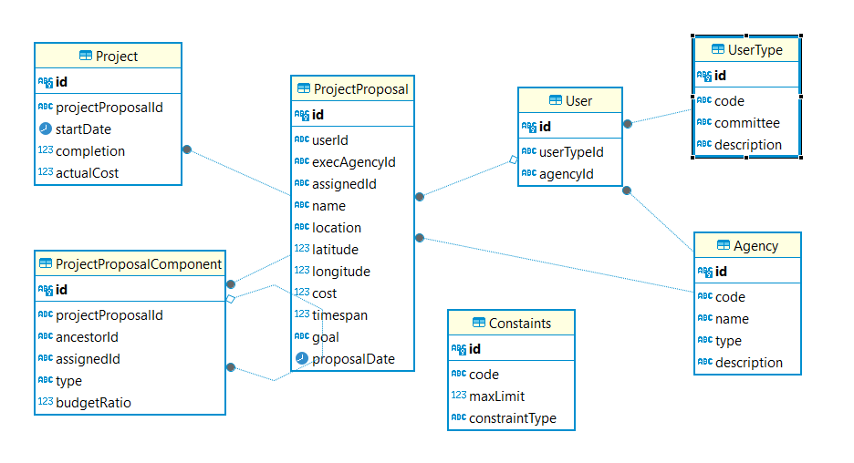

# public_project_planning_codesamurai2022

Implementing the solution for Code Samurai 2022


## Requirements

- Node.js 18+ and npm

## Getting started

Run the following command on your local environment:

```shell
git clone https://github.com/BrickedSoft/public_project_planning_codesamurai2022.git my-project-name
cd my-project-name
npm install
```

## Section 1 - Loading the Database Solution

### Problem Summary: Loading the Database
- **Input:**
  1. projects.csv: Approved and running project details.
  2. proposals.csv: Proposed project ideas with estimated cost and times.
  3. components.csv: Project components, dependencies, completion, and costs.
  4. agencies.csv: Agency lookup for approval processes.
  5. constraints.csv: Constraints for evaluating optimal timeframes.

- **Output:**
  - Build a database system from the provided datasets.

- **Scoring:**
  - Rewards for successful file parsing, database table design, data filtering, and query API implementation.


### Solution Steps

1. **Define Prisma Models:**
   - Define models for each entity (projects, proposals, components, agencies, constraints).

2. **Initialize Prisma:**
   - Configure and initialize Prisma to connect to the database.

3. **CSV Parsing:**
   - Use `csv-parser` to read and parse CSV files.

4. **Data Validation and Cleaning:**
   - Validate and clean CSV data, filtering out invalid or incomplete records.

5. **Prisma Client Integration:**
   - Use Prisma Client to interact with the database.
   - Insert records from CSV files into corresponding Prisma models.

6. **Query APIs:**
   - Design and implement query APIs using Prisma Client for data retrieval and updates.

7. **Database System:**
   - Create a database system based on the initial datasets.


### Result

**Technologies Used:**
- **Prisma:** Object-Relational Mapping (ORM) for database interaction.
- **Prisma Client:** Auto-generated query builder for type-safe database operations.
- **Relational Database:** Stores structured data.
- **csv-parser:** Parses CSV files.
  
Run the following command on your local environment:

```shell
cd public_project_planning_codesamurai2022
npx prisma migrate dev       
npm run seed     #loads data from csv files to database tables
```
**Models:**

1. **UserType:**
   - Represents user types with a unique `id`, `code`, `committee`, and `description`.
   - Has a one-to-many relationship with the `User` model.

2. **Agency:**
   - Represents agencies with a unique `id`, `code`, `name`, `type`, and `description`.
   - Has a one-to-many relationship with the `User` model.
   - Has a one-to-many relationship with the `ProjectProposal` model.

3. **Constraints:**
   - Represents constraints with a unique `id`, `code`, `maxLimit`, and `constraintType`.

4. **User:**
   - Represents users with a unique `id`, `userTypeId`, `agencyId`, and other fields.
   - Belongs to a `UserType` and an `Agency`.
   - Has a one-to-many relationship with the `ProjectProposal` model.

5. **ProjectProposal:**
   - Represents project proposals with a unique `id` and various fields.
   - Belongs to a `User` and an `Agency` (executing agency).
   - Has a one-to-one relationship with the `Project` model.
   - Has a one-to-many relationship with the `ProjectProposalComponent` model.

6. **Project:**
   - Represents projects with a unique `id`, `projectProposalId`, `startDate`, `completion`, and `actualCost`.
   - Belongs to a `ProjectProposal`.

7. **ProjectProposalComponent:**
   - Represents project proposal components with a unique `id`, `projectProposalId`, and other fields.
   - Belongs to a `ProjectProposal`.
   - Has a self-referencing relationship ("ParentChild") for ancestor and descendants.

### Overall Approach

The solution employs Prisma, Prisma Client, a relational database, and `csv-parser` to build a database system. It includes defining models, initializing Prisma, parsing CSV files, validating data, integrating Prisma Client, designing APIs, and creating a functional database system.


## Section 2 - Optimal Timeframe Solution

 **todo**

## Section 3 - Build an App

 **todo**


## Section 4 - Dynamic Progress Reporting

  **todo**

## Project structure

```shell
.
├── README.md                       # README file
├── .github                         # GitHub folder
├── prisma                          # Prisma ORM
├── problem_statement            
│   └── migrations                  # db migrations
├── public                          # Public assets folder
├── app                             # Next.js
├── libs                            # libraries
├── package.json                    # packages 
└── tsconfig.json                   # TypeScript
```